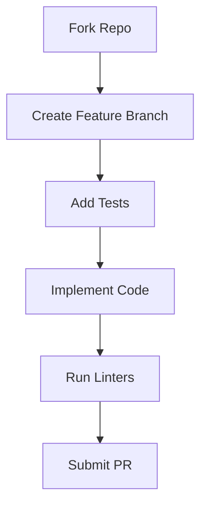

# Contributing to DataStruct-Kit

Thank you for your interest in contributing to **DataStruct-Kit**! This document provides guidelines and workflows to help you contribute effectively to this project.

---

## Table of Contents
1. [Code of Conduct](#code-of-conduct)
2. [Getting Started](#getting-started)
3. [Contribution Workflow](#contribution-workflow)
4. [Development Guidelines](#development-guidelines)
5. [Pull Request Process](#pull-request-process)
6. [Testing Requirements](#testing-requirements)
7. [Release Process](#release-process)
8. [Community](#community)

---

## Code of Conduct

By participating in this project, you agree to abide by our **Code of Conduct**. Please read [CODE_OF_CONDUCT.md](CODE_OF_CONDUCT.md) to understand what behaviors will and will not be tolerated.

---

## Getting Started

### Prerequisites
- **Python** 3.7+
- **Git**
- A **GitHub account**

### Fork and Clone
1. Fork the repository on GitHub.
2. Clone your fork locally:
   ```bash
   git clone https://github.com/YOUR-USERNAME/DataStruct-Kit.git
   cd DataStruct-Kit
   ```
3. Set up the upstream remote:
   ```bash
   git remote add upstream https://github.com/Pavansai20054/DataStruct-Kit.git
   ```

### Development Environment
1. Create a virtual environment:
   ```bash
   python -m venv venv
   source venv/bin/activate  # Windows: venv\Scripts\activate
   ```
2. Install development dependencies:
   ```bash
   pip install -e .[dev]  # Requires extras_require in pyproject.toml
   ```

---

## Contribution Workflow

### Before You Start
- Open an **issue** to discuss your proposed changes.
- Wait for maintainer approval before coding.

### Development Process



#### Step-by-Step Workflow
1. **Sync your fork with upstream:**
   ```bash
   git checkout main
   git pull upstream main
   git push origin main
   ```
2. **Create a feature branch:**
   ```bash
   git checkout -b feature/algorithm-name
   ```
3. **Make your changes:**
   - Write tests first.
   - Implement your feature.
   - Follow the coding standards.
4. **Test locally:**
   ```bash
   # Run unit tests with coverage report
   pytest --cov=DataStruct-Kit --cov-report=term-missing

   # Verify types
   mypy DataStruct-Kit/

   # Run linting
   flake8 DataStruct-Kit/
   ```
5. **Commit your changes:**
   ```bash
   git add .
   git commit -s -m "Add feature: <feature-name>"
   ```
   > **Note:** The `-s` flag adds a `Signed-off-by` line to your commit message.
6. **Push to your fork:**
   ```bash
   git push origin feature/algorithm-name
   ```

7. **Create a Pull Request.**

---

## Development Guidelines

### Coding Standards
- Follow the **PEP 8** style guide.
- Use meaningful variable and function names.
- Add **docstrings** for all functions, classes, and modules.
- Include **type hints**.

### Documentation
- Update documentation when changing functionality.
- Provide examples for new features.

### Git Commit Guidelines
- Use **present tense** (*e.g., "Add feature" not "Added feature"*).
- Use **imperative mood** (*e.g., "Fix bug" not "Fixes bug"*).
- Reference issues in commit messages.

---

## Pull Request Process

### PR Requirements
- ✅ Passing **CI tests**
- ✅ **100% code coverage** for new features
- ✅ Signed commit (`git commit -s`)
- ✅ Reference related issues

### Review Process
- All PRs undergo a **security review**.
- **72-hour waiting period** before merge.
- Maintainers have final veto power.

### After Submission
- Address review comments promptly.
- Update your branch if needed:
  ```bash
  git fetch upstream
  git rebase upstream/main
  git push -f origin feature/algorithm-name
  ```

---

## Testing Requirements

### Unit Tests
- Write tests for all new functionality.
- Maintain or improve **code coverage**.
- Test **edge cases**.

### Integration Tests
- Ensure compatibility with existing features.
- Verify **performance benchmarks**.

---

## Release Process

### Checklist for Contributors
1. Update version in:
   - `pyproject.toml`
   - `DataStruct-Kit/__init__.py`
2. Generate changelog:
   ```bash
   git log --oneline v0.1.0..HEAD > CHANGELOG.md
   ```
3. Create a PR for the version bump.

### For Maintainers
1. Review the release PR.
2. Merge to `main`.
3. Create a signed tag:
   ```bash
   git tag -s v0.2.0 -m "Release v0.2.0"
   git push --tags
   ```
4. Build and publish:
   ```bash
   python -m build

   # Test on TestPyPI first
   twine upload --repository testpypi dist/*

   # Publish to PyPI
   twine upload dist/*
   ```

---

## Community

### Communication Channels
- **GitHub Issues**: Bug reports and feature requests.
- **Discussions**: General questions and ideas.

### Recognition
Contributors will be acknowledged in:
- The project's **README**
- **Release notes**
- **Contributors file**

---

Thank you for contributing to **DataStruct-Kit**! Your efforts help make this project better for everyone.